Routing Bot 
Tutorial

For Conversation Builder

**Author:** Jon Altschuler

**Date:** 12/3/18

**Description:** This guide will help step you through setting up an Routing Bot with Conversation Builder. Connection to a LiveEngage account is not covered.  

Table of Contents

[[TOC]]

# Step 1: Create New Router Bot

This step requires that you have a user account for the Conversation Builder platform. If you do not, your team should have an Administrator assigned who can create one for you.

## Importing the Template

1. Once provided a Conversation Builder account, select your region (United States) and login at [https://alpha.botcentralai.com/#/account/signin](https://alpha.botcentralai.com/#/account/signin)


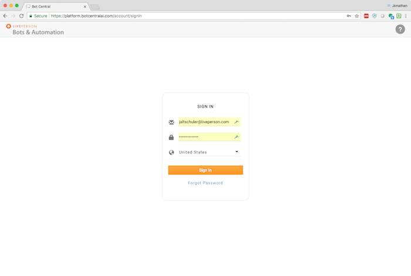

2. Click on the Bot Builder icon.

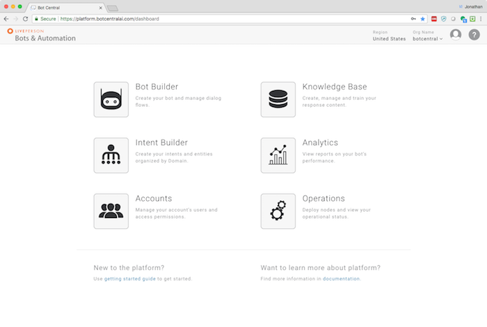

3. Tap on the NEW BOT icon and give your bot a unique name and description. Be sure to select Version 2.0 under Bot Builder and Consumer Facing Bot. Then select **Router Bot for Training** from the template area below and hit Save. 

<table>
  <tr>
    <td></td>
    <td></td>
  </tr>
</table>

4. You will be taken to your new automation in the Conversation Builder.

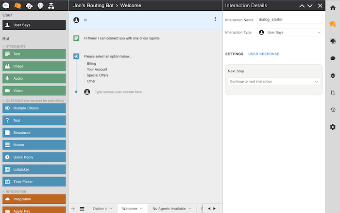

## Initial Bot Setup

1. **Before you do anything else**, we need to "Publish" the bot to your Organization. (For those with multiple Org access, the bot will default to Private, which is why we want to change it.)

    1. Tap the gear 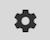 icon on the right sidebar and then Bot Settings. Scroll down and tap "More Settings".

    2. Where it says "Publish Bot" change to the appropriate Org and hit Save.

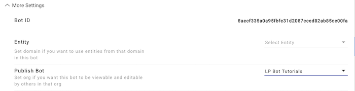

## Testing Your Bot

To quickly test your bot’s functionality, tap on the Chat preview on the right sidebar and type one of the options (or not). Keep in mind, the Chat preview is not connected to LiveEngage and cannot display the actual transfer to agent. For that you’ll need to connect your bot to LiveEngage and view in a chat or messaging client.

You may need to type "**reset**" and hit enter. Then type “hi” to trigger the initial Welcome message. **Reset** clears all variables to start fresh.

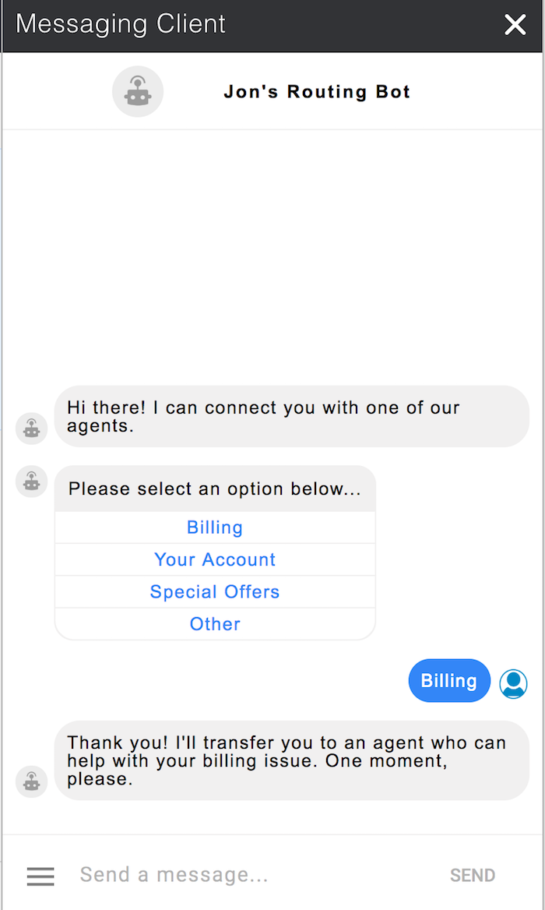

Select one of the options by tapping on a button or by typing a keyword like **billing**, **account**, **offers **or** help**.

# Step 2: Modifying the Template

Now that we’ve got our template all setup, let’s learn how our bot responds to user input.

## The Welcome

This bot is setup to **route to 4 different skills** based on certain options (Billing, Your Account, Special Offers and Other), but you can change them to whatever you like. Let’s start with the Welcome message that users will see by default.

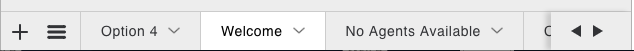

1. If it’s not already selected, select the Welcome dialog from the dialog tabs: 

    1. This dialog is set to respond to various greeting patterns. We recommend leaving this as is. At the very least, leave a "hi" pattern which we use as a default trigger. 

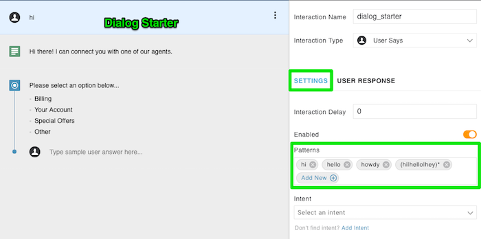

    2. The Welcome text is a simple text interaction that greets the user. Edit this greeting message to introduce the automation to your users.

    3. This Main Menu is using a multiple choice interaction to display routing options to your users.

    4. Tap on this interaction and on the right panel, make sure "USER RESPONSE" is selected. This panel allows you to determine how you want this interaction to react to the user’s next response. For the moment we are using a simple pattern to match the word “billing” (by using the pattern “billing”) which will navigate to the Option 1 dialog and the billing text interaction. Ultimately, this will trigger the escalation to the Billing skill.

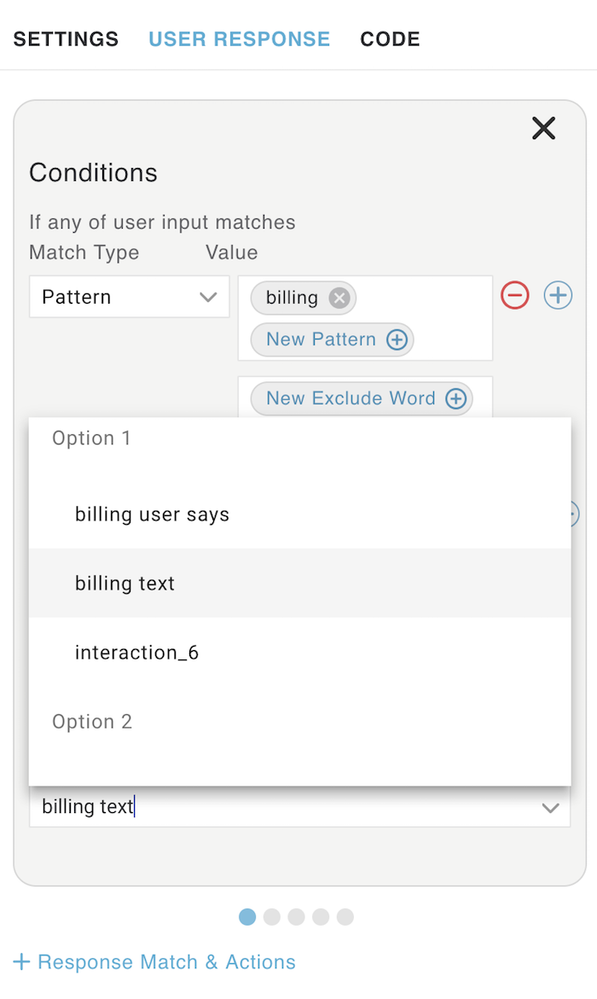

2. Let’s add more patterns to make our automation more responsive to the billing option.

    5. **Patterns match EXACT keywords and phrases **

        1. eg: **billing**, **payment**, **pay** will match these keywords **exactly**

        2. Add at least 5 single keywords to the patterns by tapping New Pattern.

        3. Enter different variations of your keywords in the previewer and see what happens.

    6. **Patterns can use alternates for specific variations **

        4. eg: **i have a question about (billing|my bill|payments|paying)** will match "i have a question about billing" or “i have question about my bill”...

        5. Add 3 different patterns using alternates

        6. Enter different variations of your alternate sentences in the previewer and see what happens.

    7. **Patterns can include wildcards for looser matches **

        7. eg: ***billing*** would match "billing", “i have a question about billing”, “i have a billing issue”, etc.

        8. Add 3-5 more patterns using wildcards

        9. Try different variations of sentences in the previewer and see what happens.

    8. Tap on each of the paging dots to see the other Conditions being matched for the other options (account, offers, other).

        10. Perform the steps we just completed for billing (**a, b, c**), for each of the other options (account, offers, other).

        11. The Other pattern could be used for something else not listed. You could add patterns for "agent", “help” or “something else” as well.

    9. The last Condition (using the wildcard * as a pattern) is a "catch-all" that will match any random utterance the user provides and direct them to the Reprompt dialog.

    10. Now that you’ve seen how we’re matching patterns, use the previewer to test these keywords and see where it works and where it fails.

## The Reprompt

From the dialog tabs, select the Reprompt dialog. Tap on the small arrow to display the dialog menu and tap Dialog Settings. Note that the **Type** for this dialog is **Fallback**. This means that this dialog  will be triggered whenever someone types in something the bot doesn’t understand. 

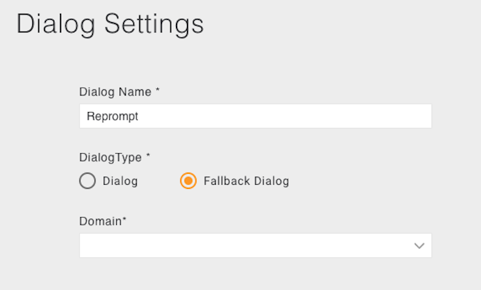

The Reprompt menu interaction should perform the same function as the Main Menu interaction. Select it and check the User Response panel. The patterns are missing! You need to add them!

1. On the User Response panel, tap on the Match Type drop down menu and select **Pattern**.

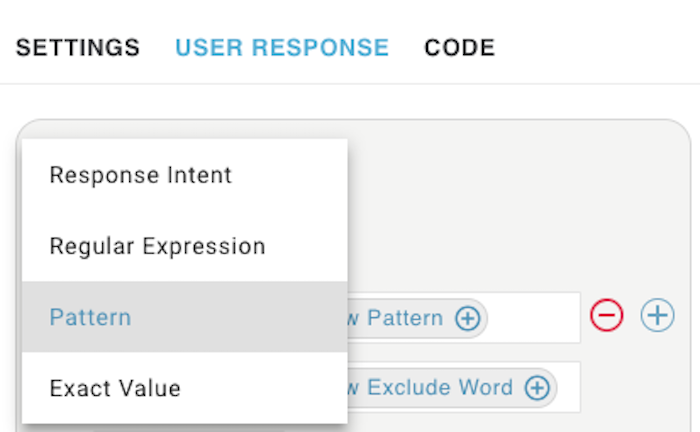

2. Tap on the New Pattern bubble and add the patterns we created earlier for **billing** and hit enter.

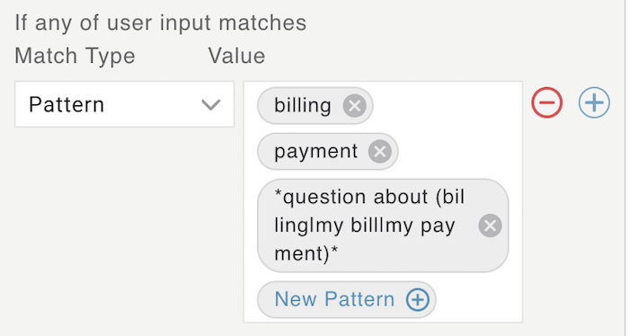

3. Now we need to tell the interaction where to go when it matches. Tap on the Next Step drop down menu and look for Option 1 > billing text. Select it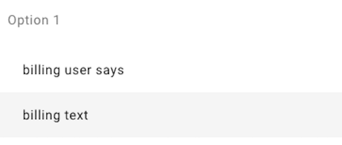

4. Let’s add the conditions for account, offers and other. Tap on the **+ Response Match & Actions link.**

5. Tap on the **+** icon next to Conditions to add another condition.

6. Perform the same steps as billing. This time use the patterns you created for "account" for the pattern.

7. From the Next Step menu select Option 2 > account text.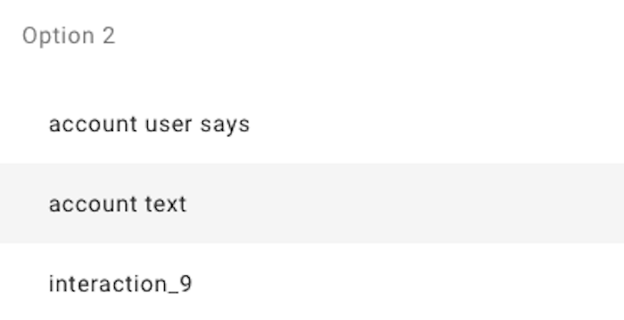

8. Add another Response Match for Special Offers.

9. Add a condition and select pattern. This time user "offer" as the pattern.

10. From the Next Step menu select Option 3 > offer text.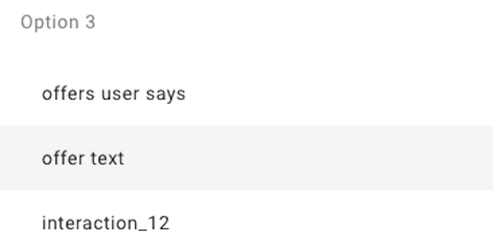

11. Add another Response Match for Other.

12. Add a condition and select pattern. This time user "other" as the pattern. 

13. From the Next Step menu select Option 4 > other text. Option 4 is the default escalation.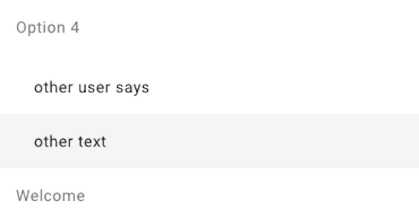

14. Since we’re already in the Reprompt dialog, if someone says anything NOT in out list of options, we don’t want them to get stuck in an infinite loop. Not fun for anyone! So let’s create one last Response Match, but THIS time let’s make our pattern a wildcard * and for the Next Step, select Option 4 > other text. This will escalate the user directly.

15. Once you’ve finished, go to the previewer and type "reset" and “hi”. Then try out your router automation. Try the buttons, try typing, try typing something unexpected and see what happens. REMEMBER: this is not connected to LiveEngage so you will not actually be escalating.

# Step 3: Intents

## Working with Intents

We’ve seen what we can do with patterns thus far. Intents are different: where patterns provide a more exact match approach, intents use NLU (Natural Language Understanding) to provide a more flexible matching approach. Let’s try it!

1. Before we make changes to our beautiful template, lets **save the current version** as a backup. Tap on the versions icon  on the right sidebar. Then tap Save Current Version, give it a name and then hit Save. This backup can now be used to revert to the last known good version of your automation.

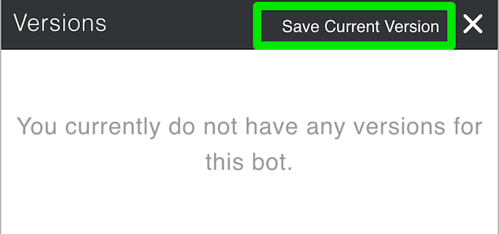

2. Exit the Bot Builder and select Intent Builder from the drop down menu at the top left.

<table>
  <tr>
    <td></td>
    <td></td>
  </tr>
</table>

1. On the Intent Builder dashboard tap the Add Domain button to create your own new Domain. Domains are groups of intents and entities, usually gathered for use with one brand or bot experience. **Give your domain a unique name** and hit Add Domain.

2. You should now be looking at a blank intent detail view like this...

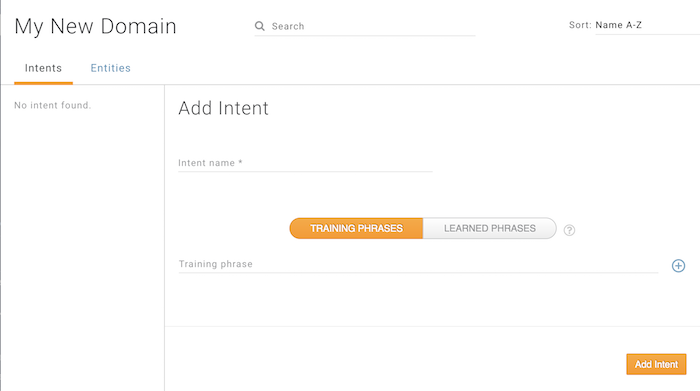

1. Now let’s create our first intent for our Billing option, give your intent a name like "I have a billing question". 

2. Then add 5 or so training phrases like "can you help me with my billing issue", etc. When done hit Add Intent. Remember these guidelines...

    1. **Intents match an ENTIRE SENTENCE** against a set of training sentences or KB articles and the results are scored based on level of confidence (VERY GOOD, GOOD, FAIR PLUS, FAIR, POOR)

    2. **Intents do NOT have to be an exact match** like patterns, but need to be similar

    3. **Intents can contain entities** for more flexible matching

3. You can test how well your intent is matching by tapping on the debugger icon on the right sidebar and entering a phrase. This phrase matched VERY GOOD, which is the highest level of confidence.

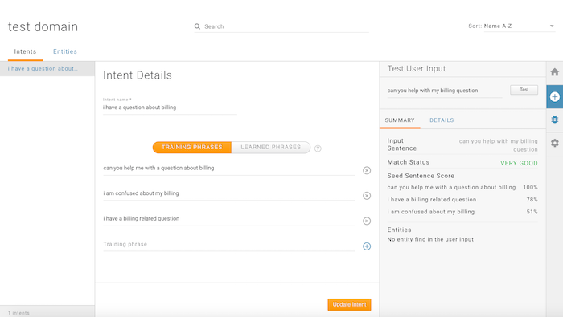

1. To try this out, we need to associate this domain with our automation and the intent with the message. 

2. Exit the Intent Builder  and then select Bot Builder from the drop down menu. Enter your bot automation and go to  Automation Settings > More Settings > Entity and select **your specific Domain** and hit Save.

3. Now select the Welcome dialog and select the Main Menu interaction again. Tap on the Interaction Settings 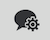 and instead of using patterns, we are going switch to our new intent. 

4. In the Match Type drop down menu, select Response Intent.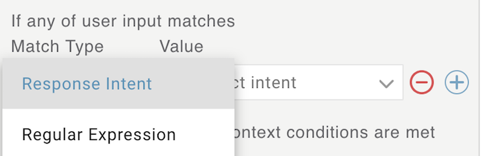

5. Now select the intent you just created for Billing.

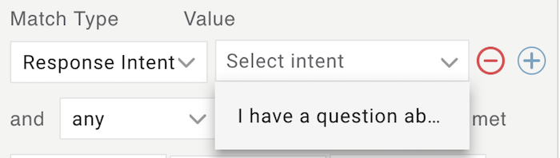

1. Tap on the previewer, type "reset" and then type something similar to your billing intents like “I need help with billing” which should now match your message, not with patterns, but with intents! 

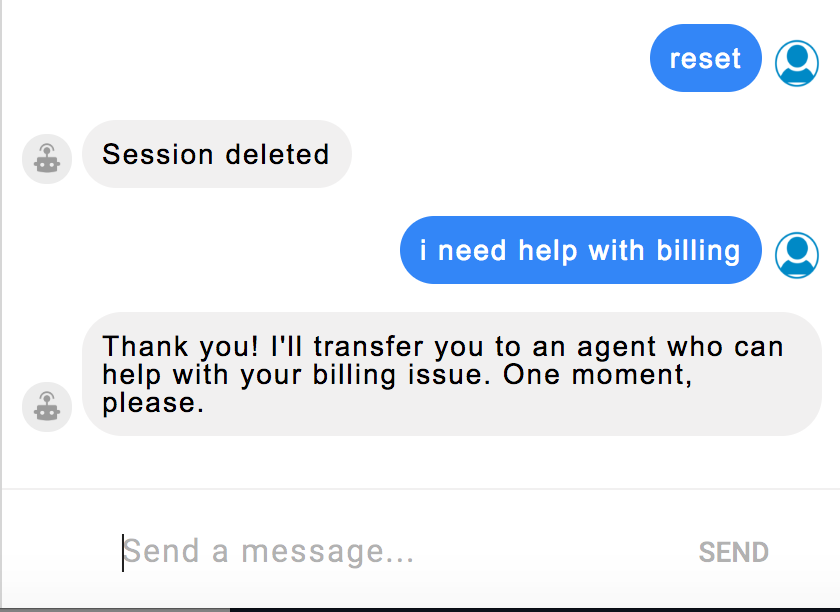

## Adding Entities

If you really want to ramp up the power of your intents, you can add **entities** to them. Entities are keywords that represent a number of synonyms (eg: the entity "billing" could represent: bills, billing, payment, statement, etc).

1. To add an entity, go back to the Intent Builder, select your Domain and select the Entities tab. 

2. Add an entity for billing (or whichever works with your intent example) with a number of synonyms and Save.

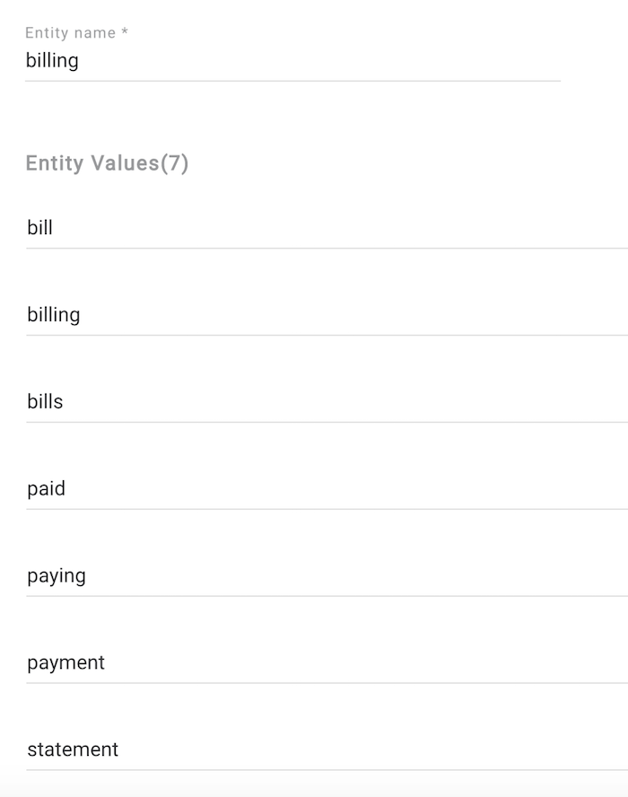

3. Now, within your intent for billing, all of those synonyms will be swapped in any time the entity name is represented (in this case **billing**). So if a user says "I have a question about my payment" it should match due to the entity being matched. You can try this in the intent debugger.

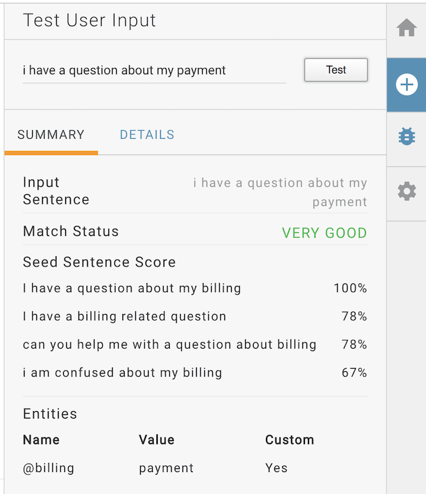

## Your Friend, the Debugger

Before we move on, it’s important to discuss a way to test and troubleshoot your automations, called the Debugger. The debugger will display all of the logs and developer added messages available for your automation. Every instance of your automation (in the previewer, on the web, in SMS, in Facebook Messenger, etc) for every single user, each have their own user id. To get your specific user id…

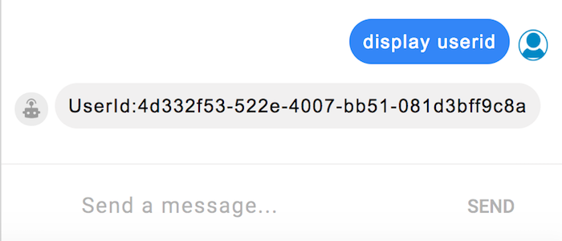

* To view debugger output, tap on the previewer and type "display userid" and copy everything **AFTER** “UserId:”.

* Next, tap on the Debugger  icon and paste that into the field and hit REFRESH.  You should be seeing the initial logs for your bot. You’ll need to hit refresh to get the latest logs.

**Add a debug message:**

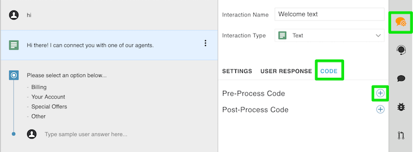

* Go to the Welcome dialog of your automation and select the greeting text interaction.

* Tap the interactions settings icon and then tap the CODE tab. This is where you can add additional JavaScript (if required) to run before or after your interaction displays. 

* We will add our debug message before the interaction is displayed. Tap the **PreProcess Code** + which will launch a JavaScript editor.

    * Add the following to the editor and hit Save. botContext.printDebugMessage(‘Here is my Welcome debug message!’);

    * NOTE: if you copy and paste the above line, the quotes may not paste correctly. Replace them using your keyboard and hit Save.

* You will need to type "**reset**" and “**hi**” to trigger the updated Welcome message. 

* Switch to the Debugger and hit Refresh. You should now see your message in the log.

* Add another debug message in one of your Options dialogs (eg: billing, etc). Did it show up?

# Step 5: Escalation

Because this is a routing bot, its main purpose is to route to a particular skill based on the user’s intent. For the purposes of this tutorial we will NOT be connecting to LiveEngage.

**Edit transfer messages:**

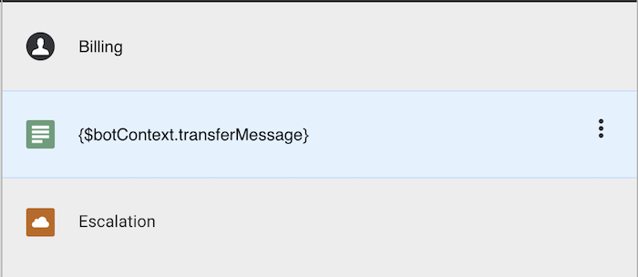

Select one of the options dialogs (eg: Billing), select the text interaction with the variable transferMessage being shown. Navigate to view the PreProcess code using the settings panel. This is where you will edit the **transfer message** for that intent, this is the message that will be sent to the user before being transferred to an agent.

* Currently the transfer message says "Thank you! I'll transfer you to an agent who can help with your billing issue. One moment, please." Edit this message to reflect your brand’s tone and personality. Hit Save and test in the previewer.

* Edit the transfer messages in each of the other Option dialogs as well.

You can also see the Escalation interaction in each of these dialogs. This will perform the API call that handles the transfer to a LiveEngage agent (once your automation is connected to a LiveEngage account).

