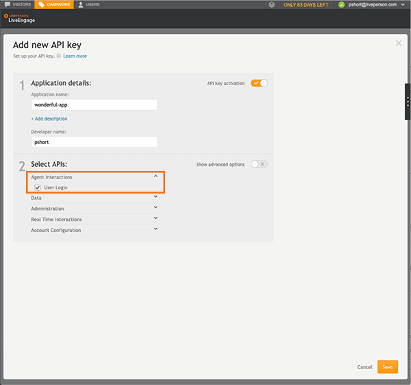
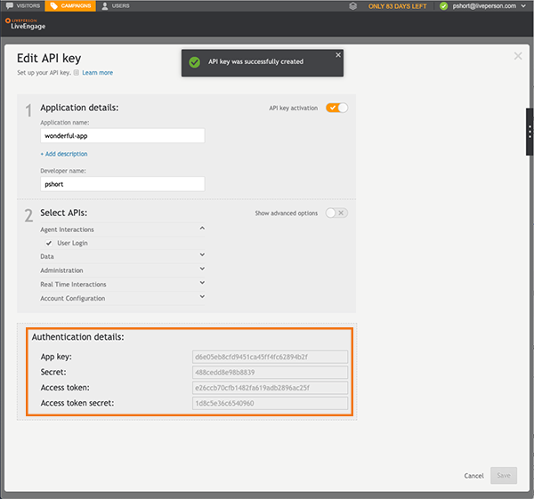

### Step 1. Create a LiveEngage account

Before you can use LiveEngage, you must first sign up for a [developer's account]([http://register.liveperson.com/developer/signup](http://register.liveperson.com/developer/signup)) and then contact your account team or LivePerson support to have features enabled.

Some features to get started with include:

- Messaging and push notifications
- Bot for User type
- Authenticated chat

---

### Step 2. Retrieve your domain

Before you get started with any LivePerson API, you must retrieve the base domain of LivePerson using the **Domain API** (a read-only API).

{:.important}
The different service names can be found in the relevant documentation for the API you're looking to use. 

#### Request

The GET method used returns an array of services and base URI for the specified account ID.

| **Method** | **URL** |
| --- | --- |
| GET | http://api.liveperson.net/api/account/{accountId}/service/baseURI.json?version=1.0 |

URL Parameters

| **Name** | **Description** | **Type/Value** | **Required** |
| --- | --- | --- | --- |
| account | LivePerson account ID | string | Yes |

#### Response

```json
{
    "baseURIs": [
        {
            "service": "liveEngageUI",
            "account": "44661254",
            "baseURI": "lo.le1.liveperson.net"
        },
        {
            "service": "visitorFeed",
            "account": "44661254",
            "baseURI": "lo.v-feed.liveperson.net"
        },
        {
            "service": "etool",
            "account": "44661254",
            "baseURI": "z2.etool.liveperson.net"
        },
```


#### Optional Response Status Codes

| **Status** | **Description** |
| --- | --- |
| 200 OK | Successfully retrieved the data. |
| 400 Bad Request | Problem with body or query parameters. |
| 401 Unauthorized | Bad Authentication (invalid site or agent). |

---

### Step 3. Add Retry and KeepAlive mechanisms

In this step, you add a mechanism to your API call to increase reliability and stability. Each component in a network can return an error, which can cause your application to fail.  If an error returns, the mechanism makes sure that your application attempts to retrieve the relevant information.

#### API error codes and retry recommendations

| **Error code** | **Description** | **Recommendation** |
| --- | --- | --- |
| 4xx | Client-side error | Do not retry, need to fix the problem in the code |
| 5xx | Error on the server side | Retry 3 times with 5, 10, 15-second pause between retries |

To make sure your application recovers from more than 3 consecutive failed requests, you must introduce another retry for login/socket close/etc. Keep the following best practices in mind when you introduce retries:

- The retry must be a longer interval than the previous one, for example, every 2 minutes or you can use [Exponential Backoff](https://jsfiddle.net/orenkatz/xqhxy8x4/).
- Make sure you do NOT define intervals that are too short because you want to give the application time to recover and retry.  Too short intervals or too many retries have an adverse effect on the target source or service, preventing the resource or service from recovering from its overloaded state, and continues to block or refuse requests. This vicious cycle reduces its ability to recover from its overloaded state.
- Once you've implemented a retry mechanism, make sure it works as expected.
- Make sure your application logs the details of faults and failing operations.  It is useful for troubleshooting the cause of a failure.

#### KeepAlive
Keep alive connections allow the client and server to use the same connection to send and receive multiple HTTP requests and responses, which helps avoid:

- 3-way handshake for new connections— a full roundtrip of latency
- slow-start

Keep-alive connections are enabled by default in HTTP/1.1 while not in HTTP/1.0. HTTP/1.0 was designed to close the connection after every request between the client and server.

Some of our services require you to send periodic requests to keep your session alive. We've provided the recommended intervals per product:

| **Product** | **Method name** | **KeepAlive interval** |
| --- | --- | --- |
| Chat Agent API | [refresh](https://developers.liveperson.com/agent-refresh.html) | Every 5 minutes |
| Messaging Agent SDK | getClock | Every 30 seconds |
| Messaging Window API | getClock | Every 30 seconds |
| Server Chat API | [Retrieve Chat Information](https://developers.liveperson.com/consumer-experience-server-chat-retrieve-chat-information.html) | Every 30 seconds |

---

### Step 4. Select the login method

In this step, you choose whether to access LiveEngage sessions with the **User Login** or **Application Login** method.

#### User Login

The **User Login** method provides a way for _users_ to access and manage a LiveEngage session. A session could be a customized workspace or hosting a LiveEngage user in an external app. Use the LiveEngage username and password.

{:.notice}
Logged in users are managed under the same restrictions as regular users in LiveEngage, including password expiration, concurrent conversation limits, skill groups and so on. If your account has SSO enabled, this method is not standalone, and you must register the relevant user through your hub to provide LiveEngage with an SSO SAML assertion.

#### Application Login

The **Application Login** method provides a way for _applications_ to access and manage LiveEngage sessions, such as bots, virtual agents, or other apps that need to act as an agent. The Application Login method overcomes both issues detailed in the User Login method (above), such as password expiration or SSO integration.

{:.important}
To log in as an application, you must have the _User Type - Bot_ feature activated. If you do not, contact your account team before proceeding.  

<p style="text-align: right">
<a href="essential-resources-authentication.html" center></a></p>

--- 

### Step 5. Authorize API Calls

In this step, now that you've chosen your login method, you use the [Login Service API] to log into LiveEngage to get a session token (Bearer) to use for other related API calls.

1. Login into LiveEngage as a _user_ with credentials or an _application_ with an API key.

2. Use this token in your authentication header in the following API calls:

   - [Users API](users-api-overview.html) - updates the LiveEngage user list on regular intervals
   
   - [Login Service API](login-service-api-overview.html) - provides endpoints to manage the user session in LiveEngage
   
   - [Domain API](retrieve-api-domains-using-the-domain-api.html) - retrieves the base domain of LivePerson

---

### Step 6. Authenticate with LiveEngage

All authenticated information is encrypted and transferred over Secure Sockets Layer (SSL), using the OAuth 2.0 and OpenID Connect standards, via a JSON Web Token (JWT).  Authentication occurs when the brand's Identity Provider (IDP) provides unique information on each customer to LiveEngage via the standard OpenID Connect JWT method. The advantage is that LiveEngage displays the customer information to the brand's agent under OAuth 2.0 and OpenID Connect protocols, providing a high degree of security and certainty regarding the consumer's identity.

{:.notice}
For more details on what information is available from the IDP, refer to the [personalInfo](messaging-interactions-api-engagement-attributes.html#personalinfo) engagement attribute and the [customerInfo](messaging-interactions-api-engagement-attributes.html#customerinfo) engagement attribute.

#### Unauthenticated engagements

For unauthenticated engagements to work, contact your LivePerson account team who can enable the Unauthenticated Messaging feature on your account.

#### Authenticated engagements

1. Log into LiveEngage as Administrator and along the top open the **Campaigns** area.

2. In the footnote, click **Data Sources**.

3. In the Connectors area, and next to the authentication server, click **Configure**.

   The Authentication Server page opens.

4. In the **Define the authentication service URLs** drop-down menu, select your authentication method.

    

5.  Configure the following parameters:

   {:.important}
   You can only have one authentication type for both web and in-app messaging.

   - Implicit or Code Flow

   - OAuth 2.0 Authentication Endpoint (when using a separate browser window)

   - OAuth 2.0 Token Endpoint (when using Code Flow)

   - OAuth 2.0 JWT Public Key

   - OAuth 2.0 Client ID

   - OAuth 2.0 Client Secret (when using Code Flow)

   - JS method name and context (when using LiveEngage embedded window in Web)


<p style="text-align: right">
<a href="essential-resources-authentication.html" center></a></p>

---

### Step 7. Create an API key

If you are Application keys are security tokens that you use to log into LiveEngage. The application key gets installed automatically and assumes the security settings granted to the associated user in LiveEngage.

1. Log into LiveEngage with Administrator or Campaign Manager permissions and along the top open the **Campaigns** area.

2. In the footnote click **Data Sources**.

3. Open the API tab and click **Add new**.

   **TIP:** Alternatively, you can click on an existing key to edit its privileges.

4. Provide the name of the application and the developer name. Optionally you can provide a description of the app by clicking the **Add description** link below the Application name field.

5. Select the **Agent Interactions** category, click the **User Login** checkbox to select it, and then click **Save**.

   

6. Once the API key has been successfully created, the authentication details display for four AUTH request values, which you use in the request body of this API:

   - App key

   - Secret

   - Access token

   - Access token secret

   

7. If the window does not close automatically, click the **X** in the top right to close the window.

   

8. Using the authentication details, generate an OAuth header according to the [OAuth Specification Section 9]([https://oauth.net/core/1.0/#signing\_process](https://oauth.net/core/1.0/#signing_process)).

**Example:**

| **Header Name** | **Authorization** |
| --- | --- |
| Header Value | OAuth<br>oauth_signature="JA0PvBbTAxmtLmzIWINpSVLshrY%3D", <br>oauth_version="1.0",<br>oauth_nonce="c1c04ec4-3125-44cf-9c39-cccb9343541b", <br>oauth_consumer_key="d392e7ff2e204d6c802e38fd775563d1", <br>oauth_signature_method="HMAC-SHA1", <br>oauth_token="61adad31204a4e6fab68d560f1ffb594", <br>oauth_timestamp="1261039670" <br><br>**Note:** The authorization should be contained on a single line. New lines have been inserted for clarity. |

--- 

### Next steps

Congratulations!  You are now ready to customize and implement features in LiveEngage.

- **Integrate LiveEngage with iOS and Android apps**.  When you implement the Mobile Messaging SDK and it's Monitoring APIs, brands can create and manage digital engagements.  Additionally, customers can communicate with the brand's agents through their channel of choice. For more information, refer to the Mobile Messaging SDK for [Android](mobile-app-messaging-sdk-for-android-overview.html) or [iOS](mobile-app-messaging-sdk-for-ios-overview.html).

- **Enable consumer monitoring and engagement flows** to gather reporting data about the consumer, engagements, and campaigns. By combining monitoring capabilities with our Campaigns feature, you can display tailored engagements to the right consumer at the right time. For more information, refer to the [Monitoring API](monitoring-api-overview.html).

- **Integrate a messaging bot** i **nto LiveEngage** using the [Agent Messaging SDK](messaging-agent-sdk-overview.html). Bots send/receive text messages, send structured content, transfer the conversation to other skills, change Time To Response, and close a conversation. To use the Agent Messaging SDK to connect a bot, your account must be enabled to support bot users. To check the enabled features for your account, contact your account team or LivePerson Support.

- **Manage users in LiveEngage.** For brands with a large number of agents, the user list may need to be updated on a regular basis. The user entity includes name, picture URL, password, skill, and other important user information. For more information, refer to the [Users API](users-api-overview.html).