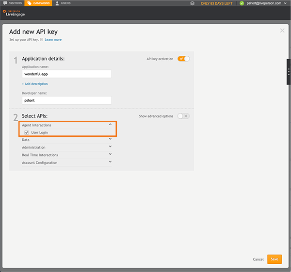
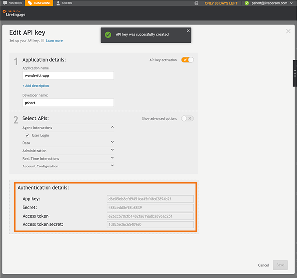

 
Application keys are security tokens that you use to log into LiveEngage. The application key gets installed automatically and assumes the security settings granted to the associated user in LiveEngage.

If required by an API, create an Application Key and it will be installed automatically upon creation.

{:.notice}
You use the API key when you create bots.

1. Log into LiveEngage with Administrator or Campaign Manager permissions and along the top open the **Campaigns** area.

2. In the footnote click **Data Sources**.

3. Open the API tab and click **Add new**.

   **TIP:** Alternatively, you can click on an existing key to edit its privileges.

4. Provide the name of the application and the developer name. Optionally you can provide a description of the app by clicking the **Add description** link below the Application name field.

5. Select the **Agent Interactions** category, click the **User Login** checkbox to select it, and then click **Save**.

   

6. Once the API key has been successfully created, the authentication details display for four AUTH request values, which you use in the request body of this API:

   - App key

   - Secret

   - Access token

   - Access token secret

   

7. If the window does not close automatically, click the **X** in the top right to close the window.

   

8. Using the authentication details, generate an OAuth header according to the [OAuth Specification Section 9](https://oauth.net/core/1.0/#signing_process).

**Example:**

| **Header Name** | **Authorization** |
| --- | --- |
| Header Value | OAuth oauth_signature="JA0PvBbTAxmtLmzIWINpSVLshrY%3D",  oauth_version="1.0", oauth_nonce="c1c04ec4-3125-44cf-9c39-cccb9343541b",  oauth_consumer_key="d392e7ff2e204d6c802e38fd775563d1",  oauth_signature_method="HMAC-SHA1",  oauth_token="61adad31204a4e6fab68d560f1ffb594",  oauth_timestamp="1261039670"   **Note:** The authorization should be contained on a single line. New lines have been inserted for clarity. |
