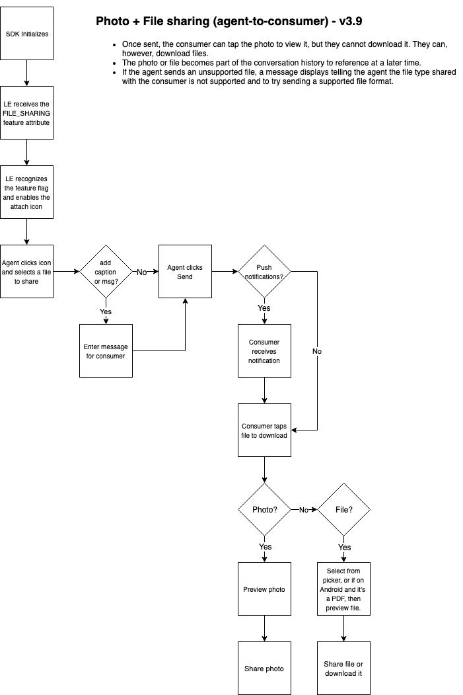

Mobile Messaging SDK v3.9 introduces a feature for agents within LiveEngage to share photos or files with the consumers.    

Agents can share:

- **Photos:** Reference photos or photos of any product to visually guide consumers with product awareness, steps on how to use the product, or review comments of a product. The agent can also share photos in a resolved conversation to resume the conversation with the consumer.  Consumers can tap on the photo to view it full screen or share it through the default app on their device.   

- **Files:** Agents can also share files to provide consumers with information such as mortgage documents, product catalog, or transaction details as requested by consumers. They can also share files in a resolved conversation to resume the conversation with the consumer. Consumers can download files through the picker application to a location on their device (internal or external).

   {:.important}
   The Android SDK supports opening any file types other than images through the picker application. The consumer can either long click on the thumbnail or open the file through picker application to share and save the file.


When the agent shares any supported file type from the LE, if the consumer isn't within the conversation view, they get a notification from the customer app only if the push notification is enabled. Otherwise, when the consumer returns to the conversation screen, a thumbnail for the photo or file appears in the conversation window.


### Supported formats

- PNG
- JPG/JPEG
- GIF (non-animated) - previewed as a static image only
- PDF
- DOCX
- PPTX
- XLSX

### Photo and file sizes

- Thumbnail - 30 KB (base64-encoded)
- Max upload size allowed - 5 MB uncompressed

   **For SDKs previous to 3.8.** The max upload size allowed is 3 MB.

### Notes and limitations

- Photo sharing is two way (agent-to-consumer and consumer-to-agent), but file sharing is one way only (agent-to-consumer) for now.

   **For SDKs previous to 3.8:** Photo sharing is one-way only (from consumer-to-agent, but not vice versa) and available for the Mobile Message SDK only.

- If an attempt to view a photo or file is unsuccessful, an error icon covers the thumbnail. Upon retry, the file attempts to download again. Retry can be attempted as many times as possible (in case of a poor network) until the file is downloaded successfully.

- The consumer can return to a resolved conversation to view the photos, as long as the photos are part of the conversation history.

- If an agent sends an unsupported file, a message displays indicating the file type shared with the consumer is not supported, and the agent should retry sending a supported file format. On the consumer side, they see an empty message with no content.

- For authenticated users, backgrounding the app while loading the photo does not get interrupted.

- For unauthenticated sessions, consumers must tap the photo again with each visit because the history gets cleared when a session expires or logs the consumer out.

- **For Android SDK 3.0 on an Oreo Device (8.0 &amp; 8.1).** Add support for Notification Channel.

### How photo and file sharing works




---   

### Step 1. Enable or disable 

1. Change the boolean value:

   ```java
   <bool name="enable_photo_sharing">
   ```
   
   By default, this value is set to **false**.

   ```java
   <bool name="enable_file_sharing">
   ```

   Starting in v3.9, the default value is set to **true**.

2. Contact your Account Team to have the feature enabled on your account.

### Step 2. Change settings

1. Set the max number of photos or files to save on disk:

   ```java
   <integer name="max_number_stored_images">

   <integer name="max_number_stored_documents">

   <integer name="max_number_stored_voice_files">
   ```

   The default is 20. If exceeding the max value of photos or files, the SDK deletes the oldest file.

2. Set the max image size:

   ```java
   <integername="max_image_size_kb">
   ```

   The default max image is 3000kb.

   **Important:** At this time, you can only set the max image size.

3. Change the color of the attachment menu:

   ```java
   <colorname="attachment_menu_item_background_color">

   <colorname="lp_attachment_menu_background_color">

   <colorname="lp_attachment_menu_item_text_color">

   <colorname="lp_attachment_menu_item_icon_color">
   ```

4. Change the text of buttons:

   ```java
   <stringname="lp_accessibility_gallery">

   <stringname="lp_accessibility_camera">
   ```

5. Define the max number of stored images allowed locally.

   ```java
   <integername="max_number_stored_images">
   ```

   The default max number is 20.

6. Define the resize dimensions:

   ```java
   <integername="thumbnail_longer_dimension_resize">
   ```

   The default thumbnail dimension is 100.

   ```java
   <integername="full_image_longer_dimension_resize">
   ```

   The default full image dimension is 800.

7. Set the compression rate (percentage) for full images:

   ```java
   <integername="full_image_compression_rate">
   ```

   The default compression rate is 50.

Other configurations can be found in the [Attributes](mobile-app-messaging-sdk-for-android-sdk-attributes-attributes.html) section of the Dev Community.
