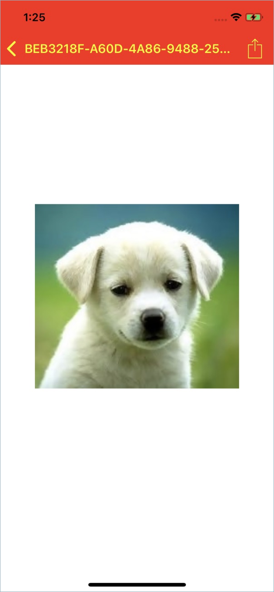
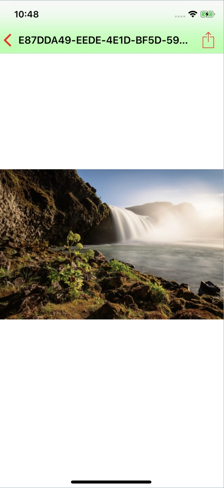

---
pagename: iOS Messaging SDK Version 3.9.0

Keywords:
sitesection: Documents
categoryname: "Messaging Channels"
documentname: Mobile App Messaging SDK for iOS


permalink: mobile-app-messaging-sdk-for-ios-release-notes-3-9-0.html
indicator: messaging
---   

### Environmental Requirements

The iOS Mobile Messaging SDK version 3.9 is compatible with Xcode 10.2.1, Swift version 5.0.1 (swiftlang-1001.0.82.4 clang-1001.0.46.5), and supported on iOS versions 10 through 12.


### Bug fixed

**Reported in SDK 3.7.1 on iOS.** When the customer sent messages just before their current token expires, the agent did not receive one or more of the messages, resulting in data loss.  After the initial token expires, the system should issue another token to reconnect and send all messages regardless if the token expires or not.

### New Feature

#### Photo and File sharing 

Mobile Messaging SDK v3.9 introduces a feature for agents within LiveEngage to share photos or files with the consumers.  

Agents can share:

- **Photos:** Reference photos or photos of any product to visually guide consumers with product awareness, steps on how to use the product, or review comments of a product. They can also share photos in a resolved conversation to resume the conversation with the consumer.  Consumers can tap on the photo to view it full screen or share it through the default app on their device.   

- **Files:** Agents can also share files to provide consumers with information such as mortgage documents, product catalog, or transaction details as requested by consumers. The agent can also share files in a resolved conversation to resume the conversation with the consumer. Consumers can download files through the picker application to a location on their device (internal or external).

{:.important}
The iOS SDK supports previewing all the supported file types on the device as per the iOS operating system by double-clicking on the thumbnail image.

When the agent shares any supported file type from the LE, if the consumer isn't within the conversation view, they get a notification from the customer app only if the push notification is enabled. Otherwise, when the consumer returns to the conversation screen, a thumbnail for the photo or file appears in the conversation window.

### Supported formats

- PNG
- JPG/JPEG
- GIF (non-animated) - previewed as a static image only
- PDF
- DOCX
- PPTX
- XLSX

### Photo and file sizes

- Thumbnail - 30 KB (base64-encoded)
- Max upload size allowed - 5 MB uncompressed

   **For SDKs previous to 3.8.** The max upload size allowed is 3 MB.

### Notes and limitations

- Photo sharing is two way (agent-to-consumer and consumer-to-agent), but file sharing is one way only (agent-to-consumer) for now.

   **For SDKs previous to 3.8:** Photo sharing is one-way only (from consumer-to-agent, but not vice versa) and available for the Mobile Message SDK only.

- If an attempt to view a photo or file is unsuccessful, an error icon covers the thumbnail. Upon retry, the file attempts to download again. Retry can be attempted as many times as possible (in case of a poor network) until the file is downloaded successfully.

- The consumer can return to a resolved conversation to view the photos, as long as the photos are part of the conversation history.

- If an agent sends an unsupported file, a message displays indicating the file type shared with the consumer is not supported, and the agent should retry sending a supported file format. On the consumer side, they see an empty message with no content.

- For authenticated users, backgrounding the app while loading the photo does not get interrupted.

- For unauthenticated sessions, consumers must tap the photo again with each visit because the history gets cleared when a session expires or logs the consumer out.


### How photo and file sharing works


---   

### Step 1. Set app permissions

1. Set the photo library privacy settings:

   - **Key:** NSPhotoLibraryUsageDescription

   - **Value:** "A message that tells the user why the app is requesting access to the user's photo library."

   - **Key:** NSPhotoLibraryAddUsageDescription

      Supported on iOS 11 and newer. Use if not sharing photos from consumer to agent.

   - **Value:** A message that tells the user why the app is requesting write only access to the user's photo library.

      **Important:** The user must explicitly grant permission for your app to access Photos. Prepare your app for this requirement by providing justification strings. The justification string is a localizable message that you add to your app's Info.plist file to tell the user why your app needs access to the user's photo library. For more details, see [Requesting Authorization to Access Photos](https://developer.apple.com/documentation/photokit/requesting_authorization_to_access_photos).

2. Set the camera privacy settings:

   - **Key:** NSCameraUsageDescription

   - **Value:** "Camera Privacy Setting for LiveEngage Mobile App Messaging SDK for iOS"

3. Set the file sharing privacy settings:

   iOS supports the preview of file types per iOS operating system and requires some configurations to be enabled within the Host App's plist file. Enabling supports file sharing, and the export and saving of photos.

   - **Key:** UIFileSharingEnabled: Application supports iTunes file sharing

   - **Value:** YES

   - **Key:** LSSupportsOpeningDocumentsInPlace: Supports opening documents in place

   - **Value:** YES

      **Warning:** If this functionality is important to your user flow, enable at the user's risk. If you enable this setting, the consumer can save documents or photos to a directory belonging to the host app.  However, we recommend not enabling this feature due to a current limitation within the LivePerson SDK, the SQL files are also made public if this setting is enabled.

### Step 2. Enable or disable photo and file sharing within the SDK

1. Change the boolean value:

   ```swift
   LPConfig.defaultConfiguration.enablePhotoSharing
   ```

   By default, the value is set to **false**.

   ```swift
   LPConfig.defaultConfiguration.enableFileSharing
   ```

   By default, the value is set to **true**.

2. Contact your Account Team to have the feature enabled on your account.

### Step 3. Change the settings

1. Set the max number of photos or files to save on disk (each is configured separately):

   ```swift
   // photos
   LPConfig.defaultConfiguration.maxNumberOfSavedFilesOnDisk    

   // document files
   LPConfig.defaultConfiguration.maxNumberOfSavedDocumentsOnDisk 
   ```

   The default is 20. If exceeding the max value of photos or files, the SDK deletes the oldest file.

2. Change the background color of attachment menu:

   ```swift
   LPConfig.defaultConfiguration.photosharingMenuBackgroundColor
   ```

3. Change the text of buttons:

   ```swift
   LPConfig.defaultConfiguration.photosharingMenuButtonsTextColor
   ```

4. Change the menu button's background color:

   ```swift
   LPConfig.defaultConfiguration.photosharingMenuButtonsBackgroundColor
   ```

5. Change the menu button's tint color:

   ```swift
   LPConfig.defaultConfiguration.photosharingMenuButtonsTintColor
   ```

6. Customize the navigation bar on UIDocumentationInteractionController:

   **Window Mode:**

   The UIDocumentationInteractionController adopts applicable branding customizations that have been set, for example:

   - conversationNavigationBackgroundColor sets the NavController tint color with translucence set to false.

   - conversationNavigationTintColor colors the L &amp; R bar buttons as well as the title color.

   

   **View Controller Mode:**

   Your custom applicable navigation bar traits apply to the UIDocumentationInteractionController.

   


You can find all the related configurations in the [resources ID table](http://localhost:4000/consumer-experience-ios-sdk-attributes.html), under Photo Sharing. The color, font selections and other customizations of the message bubbles for file and photo sharing from agents adhere to the [remoteUserBubble](remoteUserBubble) configurations.  For the messages containing photos being shared from consumer to agent can be configured via the [userBubble](mobile-app-messaging-sdk-for-ios-sdk-attributes-attributes.html#userbubblebackgroundcolor) customizations.


  


<br>
<p style="text-align: left">
<a href="mobile-app-messaging-sdk-for-ios-all-release-notes.html" center></a></p>